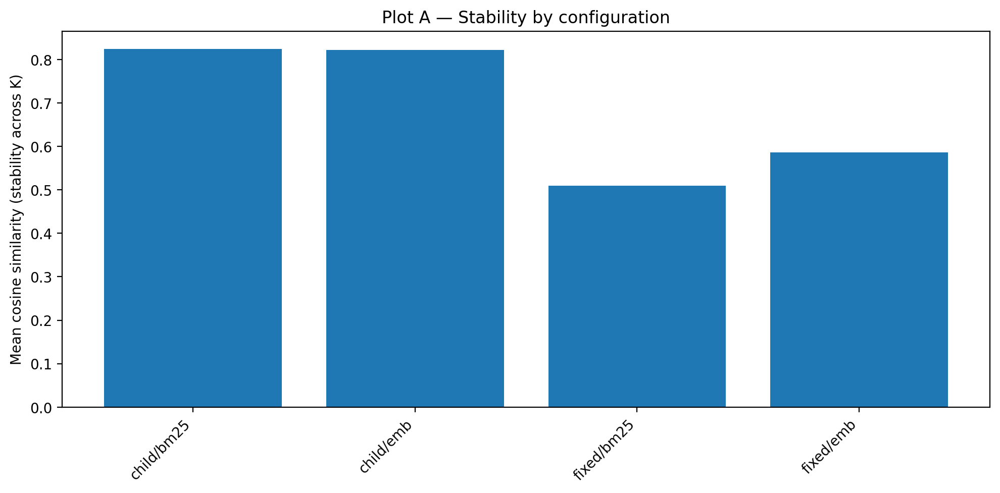
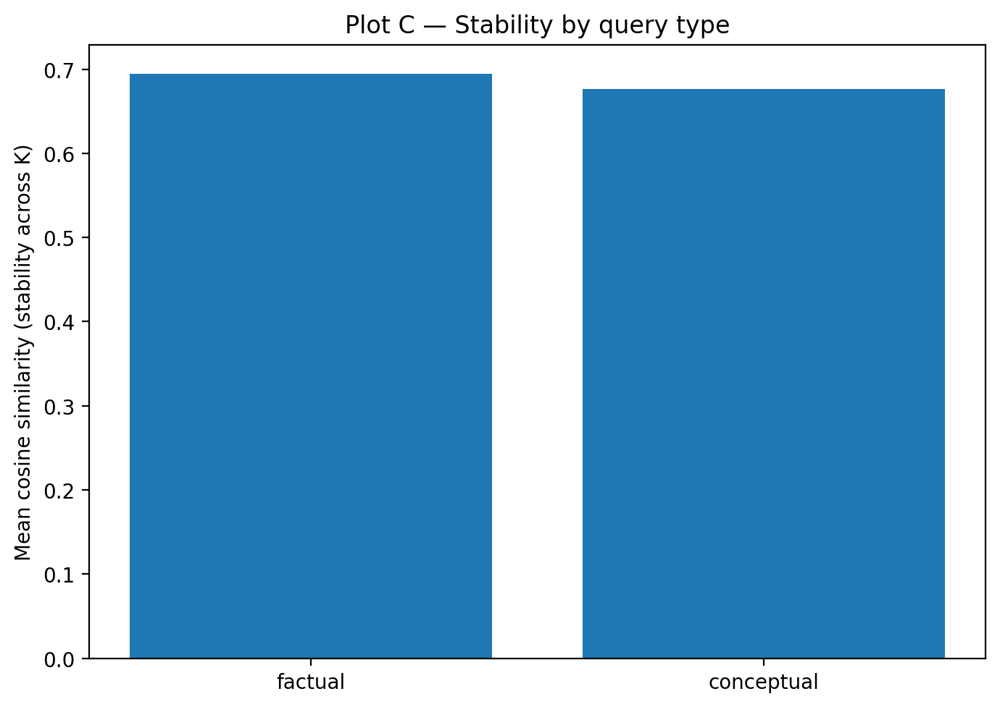
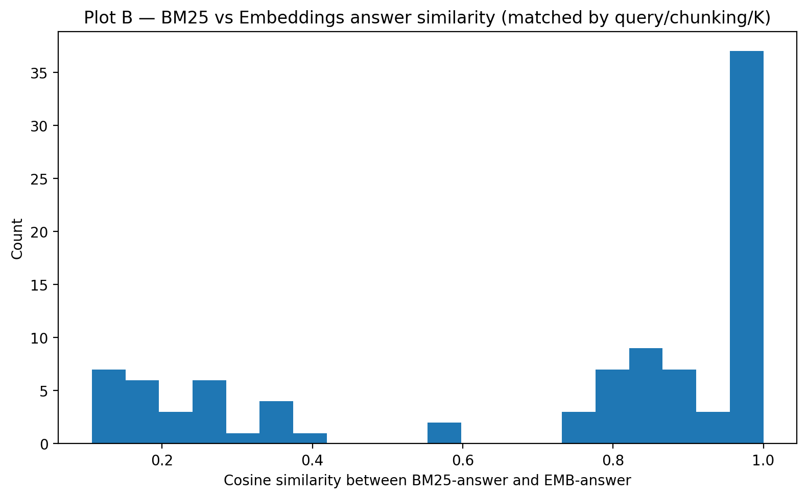

# 📊 RAG Evaluation Report  
**Chunking, Retrieval, and Stability Analysis**

---

## 1. Chunking Methodology (Assigned Method)

### Father–Son (Parent–Child) Chunking

The main chunking strategy used in this project is the **Father–Son (Parent–Child)** method, which was the method assigned to us.  
This hierarchical chunking approach is designed to balance **context preservation** and **retrieval precision** in long parliamentary documents.

Each document is first segmented into **parent chunks**, created by grouping consecutive sentences up to a relatively large word limit. These parent chunks preserve thematic continuity across extended parts of the text.  
Each parent chunk is then subdivided into **child chunks**, which are smaller, sentence-based segments with minimal overlap.

This design has two main advantages:
- **Improved recall**: parent chunks ensure that relevant regions of the document are not missed.
- **Improved precision**: child chunks reduce noise by focusing retrieval on tightly scoped semantic units.

This approach is particularly well suited for long and structured texts such as parliamentary debates.

---

## 2. Large Language Model (LLM)

We used **Qwen 2.5 (3B)** via **Ollama** as the LLM in our RAG pipeline.

The reasons for this choice are:
- Local and offline execution, ensuring reproducibility
- Low computational cost and fast inference
- Adequate generation quality when combined with high-quality retrieved context

Since this is a Retrieval-Augmented Generation system, answer quality depends primarily on retrieval quality rather than model size.

---

## 3. Vector Representation Methods

Two retrieval representations were evaluated:

### BM25 (Lexical Retrieval)
BM25 relies on exact word matching and is especially effective for:
- Factual queries
- Named entities
- Dates, numbers, and organizations

### Dense Embeddings (Semantic Retrieval)
We used **MPNet (`all-mpnet-base-v2`)** to generate dense embeddings.  
This approach captures semantic similarity and enables retrieval even when the query is a paraphrase of the source text.

---

## 4. Choice of K (Number of Retrieved Chunks)

We evaluated **K = 3, 5, and 8**, representing different trade-offs:

- **K = 3**: high precision, lower recall
- **K = 5**: balanced precision and recall
- **K = 8**: higher recall but increased noise

To analyze sensitivity to K, we measured **answer stability across K values** using cosine similarity between generated answers.

---

## 5. Stability by Configuration (Plot A)

**Figure 1 – Stability by configuration**

This plot shows the mean cosine similarity of generated answers across different K values for each configuration.

**Observations:**
- Configurations using **child chunking** show significantly higher stability.
- Fixed-size chunking, especially with BM25, is substantially less stable.

**Conclusion:**  
The Father–Son chunking method clearly outperforms fixed-size chunking in terms of robustness and consistency.

---

## 6. Stability by Query Type (Plot C)

**Figure 2 – Stability by query type**

Factual queries exhibit slightly higher stability than conceptual queries.  
This is expected, as conceptual questions require higher-level reasoning and are more sensitive to retrieval variation.

---

## 7. BM25 vs Embeddings Answer Similarity (Plot B)

**Figure 3 – Histogram of cosine similarity between BM25-based and embedding-based answers**

This histogram compares answers produced using BM25 retrieval versus embedding-based retrieval.

**Key insight:**
- The distribution is bimodal.
- Some answers are nearly identical (cosine ≈ 1.0).
- Others differ significantly (cosine ≈ 0.1–0.3).

This shows that BM25 and embeddings often retrieve fundamentally different contexts.

---

## 8. Retrieval Quality Analysis

- **Relevant chunks were retrieved**, especially with child chunking.
- **Recall improved with larger K**, but at the cost of increased noise.
- **Child chunks reduced irrelevant retrieval**, even for larger K.
- Generated answers in stable configurations closely matched the retrieved chunks.

---

## 9. Key Insights and Conclusions

1. Chunking strategy has the strongest impact on RAG stability.
2. Father–Son chunking produces more consistent and reliable answers.
3. BM25 performs well on factual queries, while embeddings are better suited for conceptual queries.
4. K = 5 provides the best trade-off between precision and recall.
5. Answer stability is an effective metric for evaluating RAG pipelines.

---

## 10. Final Takeaway

This evaluation demonstrates that hierarchical chunking combined with semantic retrieval leads to a robust and stable RAG system, even when using a lightweight LLM.
